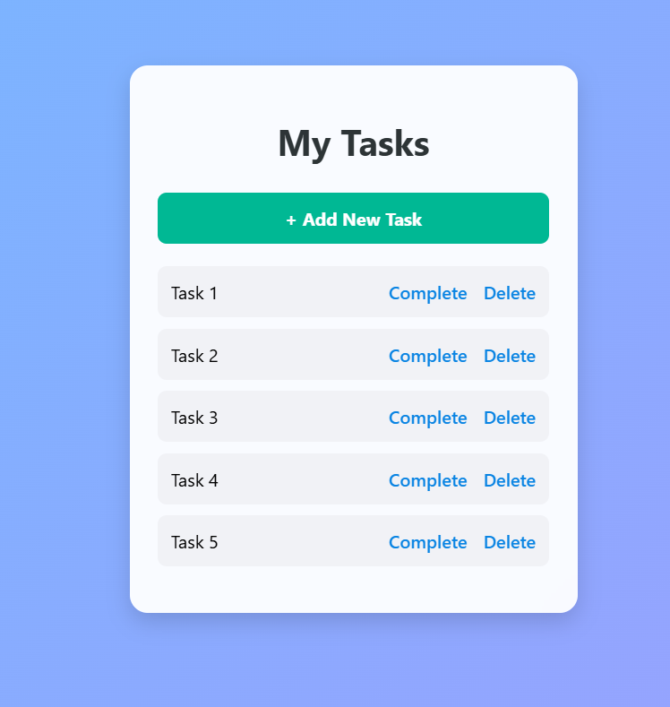
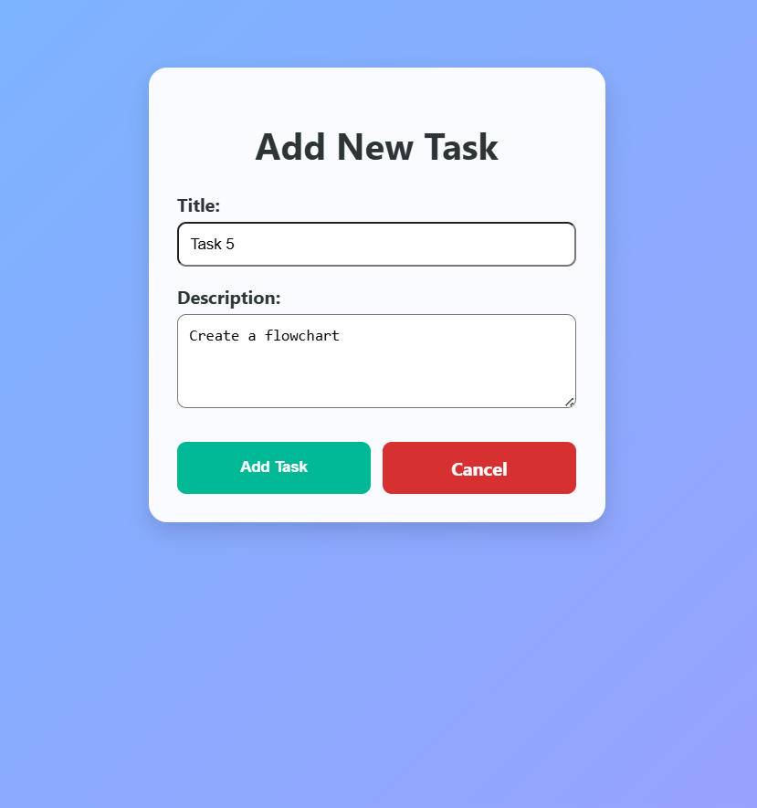
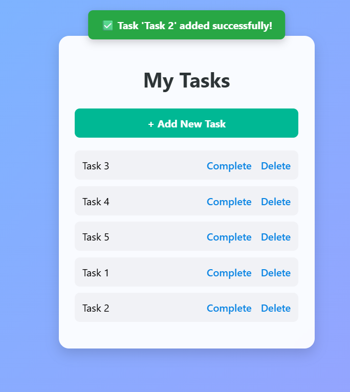

# 📝 My Django To-Do App

A simple To-Do List app built with **Django**.  
You can add, complete, and delete tasks with a clean UI and popup success messages.

## 🚀 Features
- Add new tasks
- Mark tasks as complete
- Delete tasks
- Popup success messages 

## ⚙️ Steps to Run the Project

1. cd todo_project

2. python -m venv myenv

3. myenv\Scripts\activate

4. pip install -r requirements.txt

5. python manage.py runserver

## Preview

  

   
   

